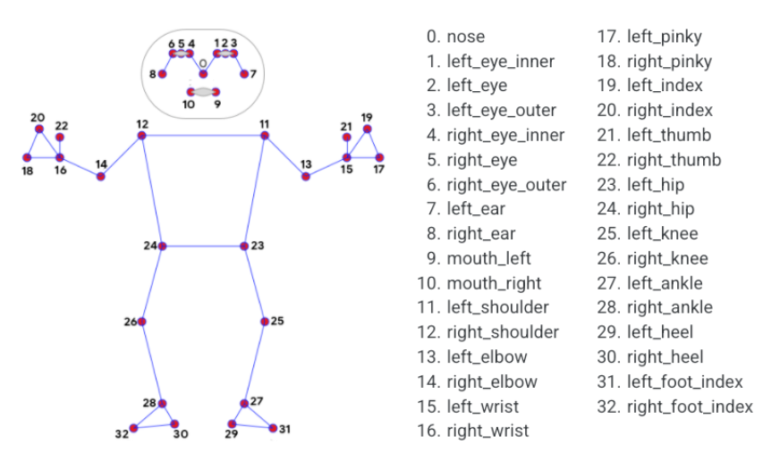

# AI Posture corrector

The goal/idea of this project is to build an AI posture corrector which will scan through the webcam of your laptop and give you suggestions based on your posture, as to what to do.

### 1. We first start by installing python libraries such as opencv for getting the video

### 2. Second step is to capture the video by using opencv

How to capture a video:
- Use cv2.VideoCapture() to create a video capture object for the camera.
- Create a VideoWriter object to save captured frames as a video in the computer.
- Set up an infinite while loop and use the read() method to read the frames using the above created object.
- Use cv2.imshow() method to show the frames in the video.
- Breaks the loop when the user clicks a specific key.

### 3. Next, we use mediapipe to capture the pose and skeleton

Mediapipe is a cross-platform library developed by Google that provides amazing ready-to-use ML solutions for computer vision tasks.

Here we will be using the MediaPipe pose landmarker, which lets you detect landmarks of human bodies in an image or video

This task uses machine learning (ML) models that work with single images or video.

The task outputs body pose landmarks in image coordinates and in 3-dimensional world coordinates.

- We first define an object for detecting the pose with mediapipe
- Next, inside the while true loop; We need to convert BGR image(default for opencv) to RGB image(mediapipe takes input in RGB)
- Now, after converting the image we draw the pose annotation to the original frame we are displaying while displaying our webcam feed with opencv

### Fig : Joints in mediapipe skeleton

### 4. Calculating joint angles for posture detection

So far we have tracked the skeleton, and the next step is to turn the visual data into meaningful numbers.
We do this by calculating the angles between joints to detect the posture.

We calculate the joint angles and display whether the posture is good or the person is slouching: 
- From the 33 points we have from mediapipe, we isolate 3 points that we will be using for calculating the posture i.e Left Shoulder, Right Shoulder and the nose.
- We calculate the absolute angle between the left and right shoulder and get its x coordinate.
- Similarly we measure the horizontal distance between the nose and the shoulder x coordinate.
- Now we compare this horizontal distance with a threshold that has been tested by me, I have personally checked various positions to arrive at this threshold of 0.015, it may also change in the future with iterations.
- And finally we display the posture status, using the opencv function putText.

### 5. 